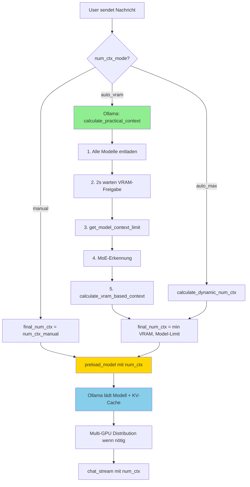

# Ollama Context Window Calculation

Dokumentation des num_ctx Berechnungs- und Preload-Flows für Ollama.

## Überblick

Bei Ollama muss `num_ctx` **VOR dem Preload** berechnet werden, damit:
1. Der KV-Cache mit der korrekten Größe allokiert wird
2. Multi-GPU Distribution korrekt erfolgt (bei mehreren GPUs)

## Zentrale Funktion: `prepare_main_llm()`

Alle Haupt-LLM Vorbereitungen nutzen diese zentrale Funktion in `aifred/lib/context_manager.py`:

```python
from aifred.lib.context_manager import prepare_main_llm

final_num_ctx, debug_msgs, preload_success, preload_time = await prepare_main_llm(
    backend=backend,
    llm_client=llm_client,
    model_name=model_name,
    messages=messages,
    num_ctx_mode="auto_vram",  # oder "auto_max" oder "manual"
    num_ctx_manual=4096,
    backend_type="ollama"
)
```

## Flow-Diagramm



**Legende:**
- Grün: VRAM-Berechnung
- Gelb: Kritischer Schritt (Preload mit num_ctx)
- Blau: Ollama-interne Verarbeitung

## num_ctx_mode Optionen

| Mode | UI-Text | Verhalten |
|------|---------|-----------|
| `auto_vram` | "Auto (VRAM-optimiert)" | Berechnet max Context der IN VRAM PASST - **SICHER** |
| `auto_max` | "Auto (Modell-Maximum)" | Nutzt native Model-Grenze (z.B. 128K) - **RISIKO CPU-Offload** |
| `manual` | "Manuell" | User-definierter Wert |

## Korrekte Reihenfolge (WICHTIG!)

```
1. calculate_practical_context() oder calculate_dynamic_num_ctx()
   → Berechnet final_num_ctx
   → Bei auto_vram: Entlädt ALLE Modelle für saubere VRAM-Messung

2. preload_model(model, num_ctx=final_num_ctx)
   → Ollama lädt Modell MIT KV-Cache für diese Context-Größe
   → Multi-GPU Distribution basiert auf diesem Wert!

3. chat_stream(options=LLMOptions(num_ctx=final_num_ctx))
   → Inferenz mit dem vorbereiteten Context
```

## Relevante Dateien

| Datei | Funktion | Beschreibung |
|-------|----------|--------------|
| `aifred/lib/context_manager.py:565` | `prepare_main_llm()` | Zentrale Funktion für Haupt-LLM |
| `aifred/backends/ollama.py:734` | `calculate_practical_context()` | VRAM-basierte Berechnung |
| `aifred/backends/ollama.py:476` | `preload_model()` | Modell laden mit num_ctx |
| `aifred/lib/gpu_utils.py:242` | `calculate_vram_based_context()` | VRAM-Berechnung |

## VRAM-Konstanten

Definiert in `aifred/lib/config.py`:

```python
# Standard-GPUs (RTX, Quadro, Gaming)
VRAM_CONTEXT_RATIO_DEFAULT = 0.55

# Datacenter-GPUs (P40, P100, A100, V100)
VRAM_CONTEXT_RATIO_DATACENTER = 0.65

# MoE-Modelle (Mixture of Experts)
VRAM_CONTEXT_RATIO_MOE = 0.45

# Sicherheitsreserve (verhindert OOM)
VRAM_SAFETY_MARGIN = 0.85
```

## Automatik-LLM vs Haupt-LLM

**Haupt-LLM:**
- Nutzt `prepare_main_llm()`
- Entlädt ALLE anderen Modelle für maximalen VRAM
- num_ctx wird VRAM-basiert berechnet

**Automatik-LLM:**
- Kein explizites Preloading/Unloading
- Vertraut auf Ollama's LRU-Strategie
- Läuft parallel zu anderen Operationen

## Debugging

Bei Problemen mit der Context-Berechnung:

1. **Debug-Console prüfen:**
   - VRAM-Messages zeigen berechneten Context
   - Preload-Messages zeigen Ladezeit

2. **Log-Datei prüfen:**
   - `logs/aifred_debug.log`
   - Suche nach "num_ctx" oder "VRAM"

3. **Ollama direkt prüfen:**
   ```bash
   # Geladene Modelle
   curl http://localhost:11434/api/ps

   # Modell-Info
   curl http://localhost:11434/api/show -d '{"name":"qwen3:30b-a3b-q8_0"}'
   ```

## History

- **2025-12-18:** Refactoring auf zentrale `prepare_main_llm()` Funktion
- **2025-12-17:** Bug in `conversation_handler.py` - falsche Reihenfolge (Preload vor Calculate)
- **2025-12-15:** Initial Implementation in `state.py`
