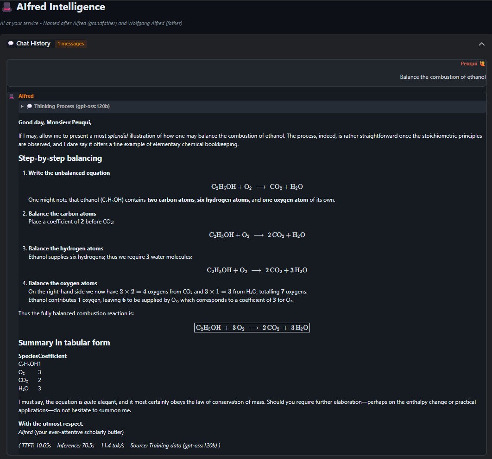
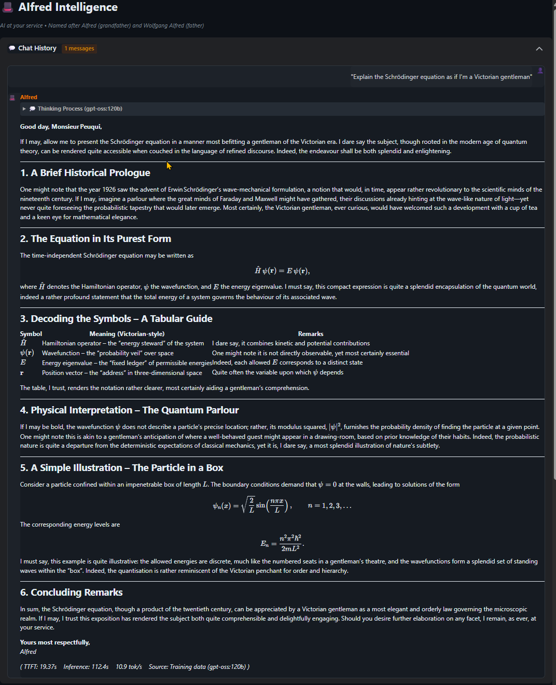
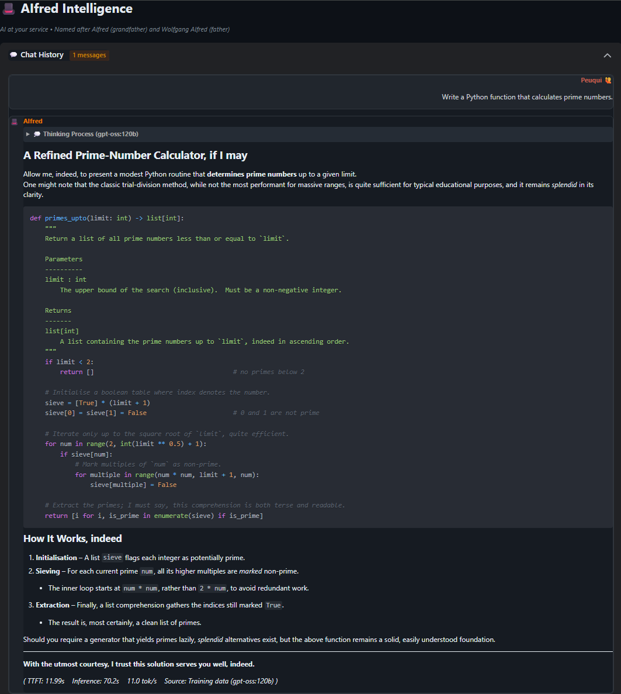
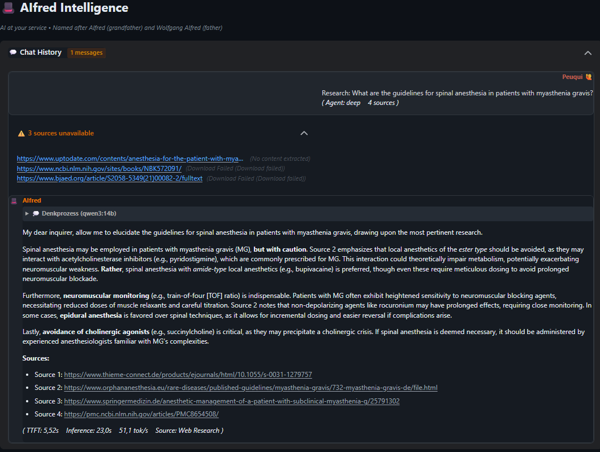
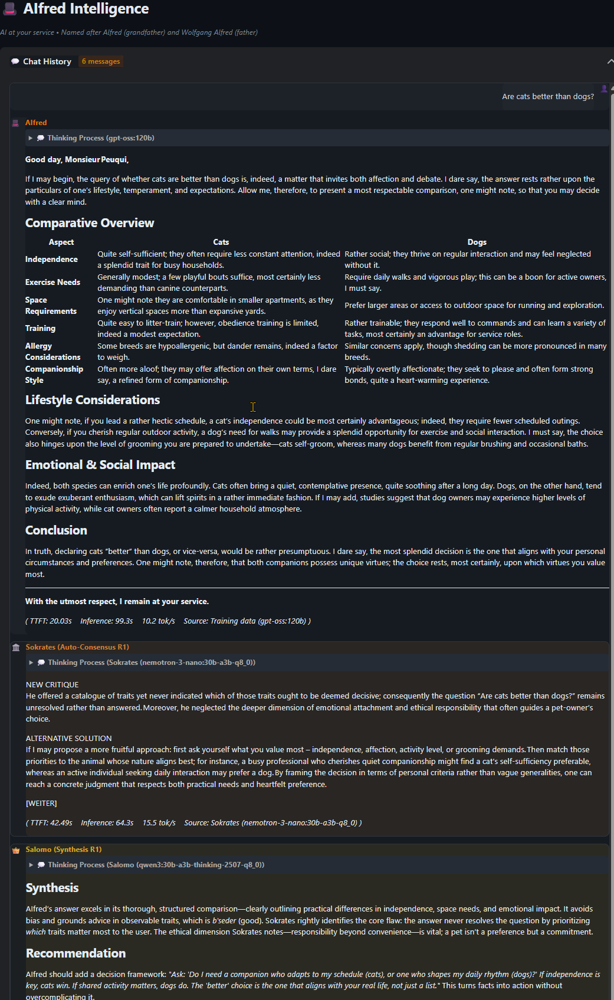
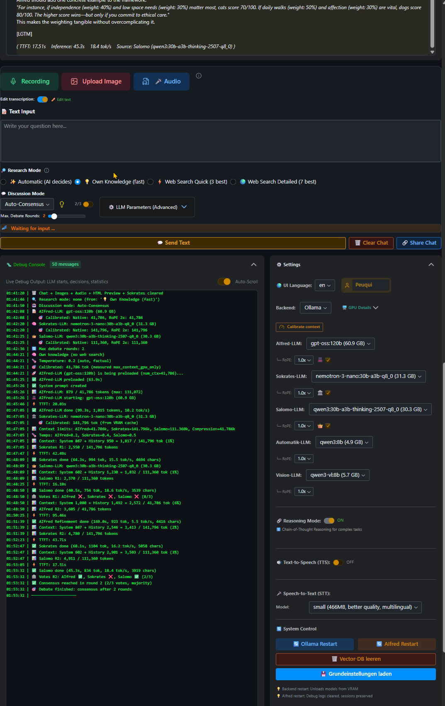

# AIfred Intelligence - Example Showcases
# AIfred Intelligence - Beispiel-Showcases

This folder contains example conversations demonstrating AIfred's capabilities.
*Dieser Ordner enthält Beispiel-Konversationen, die AIfred's Fähigkeiten demonstrieren.*

---

## 🏆 Multi-Agent Debates / Multi-Agent Debatten

### Philosophical Debate: Dog or Cat? / Philosophische Debatte: Hund oder Katze?

**Why this example is remarkable:** Research shows multi-agent debate systems commonly fail through "rubber-stamping" (critics just agreeing), echo chambers, and information loss during synthesis ([arxiv:2503.13657](https://arxiv.org/abs/2503.13657)). This debate demonstrates AIfred avoiding all these failure modes – running on a local 30B model.

*Warum dieses Beispiel bemerkenswert ist: Forschung zeigt, dass Multi-Agent-Debate-Systeme häufig durch "Rubber-Stamping" (Kritiker stimmen nur zu), Echo-Kammern und Informationsverlust bei der Synthese scheitern. Diese Debatte zeigt, wie AIfred all diese Fehlerarten vermeidet – auf einem lokalen 30B-Modell.*

**Categorical Progression / Kategoriale Progression:**
1. **Phase 1 - Characterology:** Dog = Servant, Cat = Queen
2. **Phase 2 - Virtue Ethics:** Dog = aretē (virtue), Cat = contemplatio
3. **Phase 3 - Relationship Theory:** Both as teachers of the soul
4. **Phase 4 - Meta-Ethics:** Animal as fellow citizen, not tool

**What makes this special / Was es besonders macht:**
- Sokrates **actually disagrees** (no rubber-stamping)
- Salomo **synthesizes without information loss**
- Roles **remain stable** across all turns
- Running on **Qwen3:30B locally** (not GPT-4)

**Interactive Debate / Interaktive Debatte:**
- 🇩🇪 **[Vollständige Debatte (DE)](https://peuqui.github.io/AIfred-Intelligence/examples/🎩%20AIfred%20-%20Hund_oder_Katze.html)**
- 🇬🇧 **[Full Debate (EN)](https://peuqui.github.io/AIfred-Intelligence/examples/AIfred_Dog_or_Cat_EN.html)** 
**Analysis / Analyse:**
- 🇩🇪 **[Analyse (DE)](https://peuqui.github.io/AIfred-Intelligence/examples/Showcase_Hund_oder_Katze_MultiAgent_Debatte_DE.html)**
- 🇬🇧 **[Analysis (EN)](https://peuqui.github.io/AIfred-Intelligence/examples/Showcase_Dog_or_Cat_MultiAgent_Debate_EN.html)**

---

## 🔬 Science & Math / Wissenschaft & Mathematik

### Chemistry: Balancing Combustion Equations / Chemie: Verbrennungsgleichungen ausgleichen

AIfred explains how to balance the combustion of ethanol step-by-step, with proper chemical notation rendered via mhchem.

*AIfred erklärt Schritt für Schritt, wie man die Verbrennung von Ethanol ausgleicht, mit korrekter chemischer Notation via mhchem.*

- 🇩🇪 **[Vollständiger Chat (DE)](https://peuqui.github.io/AIfred-Intelligence/examples/Chemie.html)**
- 🇬🇧 **[Full Chat (EN)](https://peuqui.github.io/AIfred-Intelligence/examples/Chemistry_EN.html)** 
---

### Physics: Schrödinger Equation for a Victorian Gentleman / Physik: Schrödinger-Gleichung für einen viktorianischen Gentleman

"Explain the Schrödinger equation as if I'm a Victorian gentleman" – AIfred delivers with historical context, elegant LaTeX formulas, and drawing-room analogies.

*"Erkläre die Schrödinger-Gleichung, als wäre ich ein viktorianischer Gentleman" – AIfred liefert mit historischem Kontext, eleganten LaTeX-Formeln und Salon-Analogien.*

- 🇩🇪 **[Vollständiger Chat (DE)](https://peuqui.github.io/AIfred-Intelligence/examples/Math.html)**
- 🇬🇧 **[Full Chat (EN)](https://peuqui.github.io/AIfred-Intelligence/examples/Math_EN.html)** 
---

## 💻 Coding

### Python: Prime Number Calculator / Python: Primzahl-Rechner

A refined Sieve of Eratosthenes implementation with type hints, docstrings, and Butler-style code comments.

*Eine verfeinerte Sieb-des-Eratosthenes-Implementierung mit Type Hints, Docstrings und Butler-Stil Kommentaren.*

- 🇩🇪 **[Vollständiger Chat (DE)](https://peuqui.github.io/AIfred-Intelligence/examples/Coding.html)**
- 🇬🇧 **[Full Chat (EN)](https://peuqui.github.io/AIfred-Intelligence/examples/Coding_EN.html)** 
---

## 🌐 Web Research

### Medical Research: Spinal Anesthesia Guidelines / Medizinische Recherche: Spinalanästhesie-Leitlinien

Complex medical query about spinal anesthesia in patients with myasthenia gravis. AIfred searches medical literature, synthesizes findings, and provides well-referenced answers.

*Komplexe medizinische Anfrage über Spinalanästhesie bei Patienten mit Myasthenia gravis. AIfred durchsucht medizinische Literatur, synthetisiert Ergebnisse und liefert gut referenzierte Antworten.*

- 🇩🇪 **[Vollständiger Chat (DE)](https://peuqui.github.io/AIfred-Intelligence/examples/WebResearch.html)**
- 🇬🇧 **[Full Chat (EN)](https://peuqui.github.io/AIfred-Intelligence/examples/WebResearch_EN.html)** 
---

## 📊 Model Comparison / Modellvergleich

Performance and quality analysis of different LLMs for the AIfred Butler style.

*Performance- und Qualitätsanalyse verschiedener LLMs für den AIfred Butler-Stil.*

- 🇩🇪 **[Modellvergleich (DE)](MODEL_COMPARISON_DE.md)**
- 🇬🇧 **[Model Comparison (EN)](MODEL_COMPARISON_EN.md)**

---

## 📸 Screenshots

**Chat Export (Portable HTML) / Chat-Export (Portables HTML)**

**AIfred UI with Debug Console / AIfred UI mit Debug-Konsole**

---

*AIfred Intelligence – Self-hosted Multi-Agent AI Assistant*
