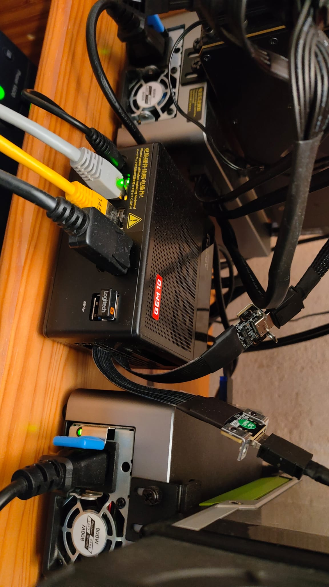
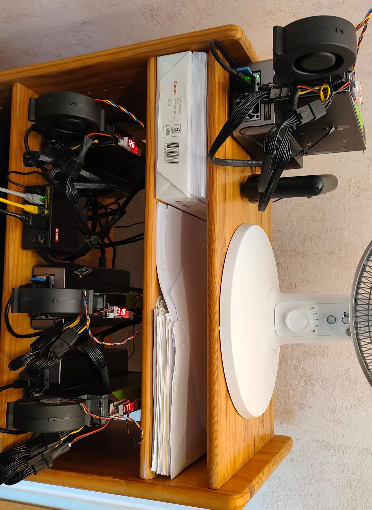

# Reddit Post Draft — r/LocalLLaMA Hardware Setup

**Title:** My Frankenstein MiniPC: 4 GPUs (3x P40 + RTX 8000 = 120 GB VRAM (~115 GB usable)) on an AOOSTAR GEM 10 — how I got there step by step (AIfred with upper "I" instead of lower "L" :-)

---

Hey r/LocalLLaMA,

A few of you asked about my hardware setup in [my previous posts](https://www.reddit.com/r/LocalLLaMA/comments/...). I promised photos and details. Here's the full story of how a tiny MiniPC ended up with 120 GB VRAM across 4 GPUs — and the frustrating journey to get there. (Of course we love to fool ourselves with those numbers — nvidia-smi says ~115 GB usable. The other 5 GB? CUDA overhead. Gone. Poof.)

**TL;DR:** AOOSTAR GEM 10 Pro Max MiniPC, 3x Tesla P40 (24 GB each) + 1x Quadro RTX 8000 (48 GB) = ~120 GB VRAM (~115 GB usable). Runs 235B parameter models fully GPU-resident, 24/7, at ~60W idle. Cost me way too many evenings and one ruined fan grille.

---

## The Base: AOOSTAR GEM 10 Pro Max

- AMD Ryzen 9 7945HX, 32 GB RAM
- 3x M.2 2280 NVMe slots (1 TB SSD installed, 2 free)
- 1x OCuLink port (external)
- 1x USB4 port (external)
- Compact, silent enough, runs 24/7

I originally bought it as a simple home server. Then I discovered that you can hang GPUs off it. That's where things got out of hand.

---

## Step 1: First GPU — P40 via OCuLink

Bought an AOOSTAR AG01 eGPU adapter, plugged a Tesla P40 into it, connected via OCuLink. Worked immediately. 24 GB VRAM, no issues. I was running 30B models and thought "this is great, I'm done."

I was not done.

## Step 2: Second GPU — P40 via USB4

Added an AOOSTAR AG02 eGPU adapter with another P40, connected via USB4. Also worked immediately. 48 GB total. Now I could run 80B MoE models. The MiniPC handles both OCuLink and USB4 simultaneously — they don't share lanes.

## Step 3: Third GPU — P40 via internal M.2 (the one with the saw)

This is where it gets creative. I bought an M.2-to-OCuLink adapter, opened up the MiniPC, plugged it into one of the free M.2 slots. Then I realized I needed to get the OCuLink cable out of the case somehow.

Solution: I took a saw to the fan grille on the side panel. Cut a slot just wide enough for the cable. Not pretty, but it works. Connected another AG01 adapter with a third P40. 72 GB total.

## Step 4: The RTX 8000 — Where Things Got Frustrating

I bought a Quadro RTX 8000 (48 GB) with the plan to eventually replace all P40s with RTX 8000s for maximum VRAM. The dream: 4x 48 GB = 192 GB.

First problem: The RTX 8000 would NOT work in the AG01 connected via the internal M.2-to-OCuLink adapter. It wouldn't even complete POST — just hung at the handshake. The P40s worked fine in the same slot. Tried different BIOS settings, tried the Smokeless BIOS tool to access hidden UEFI variables — nothing helped.

So I moved it to the AG02 (USB4). It worked there, but that meant I lost a P40 slot. Days of frustration.

## Step 5: ReBarUEFI — The Breakthrough

By chance I stumbled upon [ReBarUEFI by xCuri0](https://github.com/xCuri0/ReBarUEFI). The problem was that the GEM 10's BIOS doesn't expose Resizable BAR settings, and the RTX 8000 needs a BAR larger than the default 256 MB to work over OCuLink. The P40s are older and don't care.

ReBarState writes the BAR size directly into the UEFI NVRAM. I set it to 4 GB, rebooted — and suddenly the RTX 8000 worked over OCuLink. In the AG01, in the M.2-to-OCuLink adapter, everywhere. I nearly fell off my chair.

Big shout-out to AOOSTAR support — they were involved from day one. Before I bought anything, I asked them if the GEM 10 could drive two eGPU adapters simultaneously via OCuLink + USB4. They confirmed it, so I went ahead and bought the AG01 + AG02 together. Later I asked about using internal M.2 slots with third-party M.2-to-OCuLink adapters — they said they don't sell their own but it should work in principle. It did. They also confirmed "Above 4G Decoding" is enabled in the BIOS even though there's no visible toggle. Fast responses, honest answers. Can't complain.

## Step 6: Final Setup — 4 GPUs

With ReBAR sorted, I bought one more AG01 adapter and another M.2-to-OCuLink adapter (second sawed slot in the fan grille). Final configuration:

| GPU | VRAM | Connection | Adapter |
|-----|------|-----------|---------|
| Tesla P40 #1 | 24 GB | OCuLink (external port) | AG01 |
| Tesla P40 #2 | 24 GB | M.2 → OCuLink (internal, sawed grille) | AG01 |
| Tesla P40 #3 | 24 GB | M.2 → OCuLink (internal, sawed grille) | AG01 |
| RTX 8000 | 48 GB | USB4 (external port) | AG02 |
| **Total** | **120 GB (~115 usable)** | | |

Each connection runs at PCIe x4 — not shared, not throttled. Measured and verified. It's not x16 server speed, but for LLM inference where you're mostly doing sequential matrix multiplications, it's absolutely fine.

---

## The Numbers That Matter

**Cooling:**

The P40s and RTX 8000 are server/workstation cards — passive or blower-style coolers designed for chassis airflow that doesn't exist in an open shelf. So I 3D-printed fan adapters and mounted BFB1012HH fans on each card with a temperature-controlled fan controller. I initially tried higher-CFM fans of the same size (BFB1012VH) but they were unbearably loud and didn't actually cool any better. The BFB1012HH are the sweet spot — quiet enough to live with, even at full speed. Works great — even at 100% GPU load on a single card, nvidia-smi rarely shows temperatures above 50°C. The eGPU adapters have small built-in fans, but I've rarely heard them spin up — they just pass through PCIe, not much to cool there.

**What it all cost (all used, except adapters):**

| Component | Price | Source |
|-----------|-------|--------|
| AOOSTAR GEM 10 MiniPC | ~€450 | New (bought before the RAM price surge — should have gotten the 64GB version) |
| Tesla P40 #1 + #2 | ~€190 each | AliExpress (+ customs to EU) |
| Tesla P40 #3 | ~€200 | AliExpress (+ customs) |
| RTX 8000 | ~€1,200 | Used, Germany |
| AG01 eGPU adapter (x3) | ~€155 each | AOOSTAR |
| AG02 eGPU adapter (x1) | ~€210 | AOOSTAR |
| M.2-to-OCuLink adapters (x2, K49SQBK, PCIe 5.0, active chip) | ~€45-50 each + customs | AliExpress |
| BFB1012HH fans (x4) | ~€10 each | AliExpress |
| PWM fan controllers w/ temp probes (x4) | ~€10 each | AliExpress |
| 3D-printed fan adapters | Free (self-printed) | |
| **Total** | **~€3,200** | |

For ~€3,200 you get a 120 GB VRAM (~115 GB usable) inference server that runs 235B models 24/7 at 60W idle. Not bad. The RTX 8000 is the big ticket item — if you go all-P40 (4x 24GB = 96GB) you'd be under €2,000.

**Power consumption (idle):**
- Tesla P40: ~9-10W each (x3 = ~30W)
- RTX 8000: ~20W
- MiniPC: ~7-10W
- **Total idle: ~60W**

That's a 120 GB VRAM (~115 GB usable) inference server at 60W idle power. Try that with a proper server rack.

**What it runs:**
- Qwen3-235B-A22B Instruct (UD-Q3_K_XL, 97 GB) — fully GPU-resident, 112K context, ~11 tok/s
- GPT-OSS-120B (Q8, 60 GB) — fully GPU-resident, 131K context, ~50 tok/s
- Qwen3-Next-80B (Q8_K_XL, 87 GB) — fully GPU-resident, 262K context, ~35 tok/s
- Nemotron-3-Super-120B (Q5_K_XL, 101 GB) — fully GPU-resident, 874K context, ~17 tok/s

All running through llama.cpp via llama-swap with Direct-IO and flash attention. Model swaps take ~20-30 seconds thanks to Direct-IO memory mapping.

**Full model roster (llama-swap config):**

| Model | Size | Quant | GPUs | Tensor Split | Context | KV Cache | TG tok/s |
|-------|------|-------|------|-------------|---------|----------|----------|
| Qwen3-4B Instruct | 4B | Q8_0 | 1 (RTX 8000) | — | 262K | f16 | ~30 |
| Qwen3-14B Base | 14B | Q4_K_M | 1 (RTX 8000) | — | 41K | f16 | ~25 |
| Qwen3-30B-A3B Instruct | 30B MoE | Q8_0 | 2 | — | 262K | f16 | ~35 |
| Qwen3-VL-30B-A3B (Vision) | 30B MoE | Q8_0 | 2 | — | 262K | f16 | ~30 |
| GPT-OSS-120B-A5B | 120B MoE | Q8_K_XL | 2 | 2:1:1:1 | 131K | f16 | **~50** |
| Qwen3-Next-80B-A3B | 80B MoE | Q8_K_XL | 4 | 22:9:9:8 | 262K | f16 | ~35 |
| Qwen3.5-122B-A10B | 122B MoE | Q5_K_XL | 4 | 2:1:1:1 | 262K | f16 | ~21 |
| Nemotron-3-Super-120B | 120B NAS-MoE | Q5_K_XL | 4 | 2:1:1:1 | **874K** | f16 | ~17 |
| Qwen3-235B-A22B Instruct | 235B MoE | Q3_K_XL | 4 | 2:1:1:1 | 112K | **q8_0** | ~11 |

All models GPU-only (ngl=99), flash-attn, Direct-IO, mlock. Context sizes auto-calibrated by AIfred to maximize available VRAM. The 2:1:1:1 tensor split means RTX 8000 gets twice as many layers as each P40 (proportional to VRAM: 48:24:24:24). Qwen3-Next-80B uses a custom 22:9:9:8 split optimized by AIfred's calibration algorithm.

llama-swap handles model lifecycle — models auto-swap on request, Direct-IO makes loading near-instant (memory-mapped), full init ~20-30s.

**What it can't do:**
- No tensor parallelism (P40s don't support it — compute capability 6.1)
- No vLLM (needs CC 7.0+, P40s are 6.1)
- The RTX 8000 (CC 7.5) gets slightly bottlenecked by running alongside P40s
- BF16 not natively supported on either GPU (FP16 works fine)

---

## What I'd Do Differently

- **64 GB RAM from the start.** 32 GB is tight when running 200B+ models with large context windows. CPU offload for KV cache eats into that fast.
- **If you can find a good deal on an RTX 8000, grab it.** 48 GB with tensor cores beats two P40s. But prices have gone up significantly — I got lucky at €1,200, most are listed above €2,000 now.
- **Don't bother with the Smokeless BIOS tool** if you need ReBAR — go straight to ReBarUEFI.

## What I Wouldn't Change

- **The MiniPC form factor.** It's silent, tiny, sips power, and runs 24/7 without complaints. A server rack would be faster but louder, hotter, and 5x the power consumption.
- **llama.cpp + llama-swap.** Zero-config model management. Calibrate once per model, it figures out the optimal GPU split and context size automatically.
- **OCuLink.** Reliable, consistent x4 bandwidth, no driver issues (unlike USB4 which was flaky at times with the RTX 8000 before ReBAR).
- **The incremental approach.** Start small, verify each step works, then expand. I wouldn't have discovered the ReBAR solution if I hadn't hit the wall with the RTX 8000 first.

**Next upgrade:** If I can get another RTX 8000 at a reasonable price, I'll swap out a P40. The dream of 4x RTX 8000 = 192 GB VRAM is still alive — now that ReBAR is sorted, it's just a matter of finding the cards.

---

## Photos

*The MiniPC (bottom center) with OCuLink cables running to the AG01 adapters and USB4 to the AG02. Yes, those are two Ethernet cables (yellow) — one for LAN, one for direct point-to-point RPC to my dev machine.*

*The complete "server rack" — a wooden shelf with 3x AG01 + 1x AG02 eGPU adapters, each holding a GPU. The desk fan is for me, not the GPUs :-)*

---

**GitHub**: https://github.com/Peuqui/AIfred-Intelligence

All of this powers [AIfred Intelligence](https://peuqui.github.io/AIfred-Intelligence/) — my self-hosted AI assistant with multi-agent debates, web research, voice cloning, and more. Previous posts: [original](https://www.reddit.com/r/LocalLLaMA/comments/...) | [benchmarks](https://www.reddit.com/r/LocalLLaMA/comments/...)

Now, if someone points out that for €3,200 you could have gotten a 128 GB unified memory MiniPC and called it a day — yeah, you're probably not wrong. But I didn't know from the start where this was going or how much it would end up costing. It just... escalated. One GPU became two, two became four, and suddenly I'm sawing fan grilles. That's how hobbies work, right? And honestly, the building was half the fun.

If you're thinking about a similar setup — feel free to ask. I've made all the mistakes so you don't have to :-)

Best,
Peuqui
